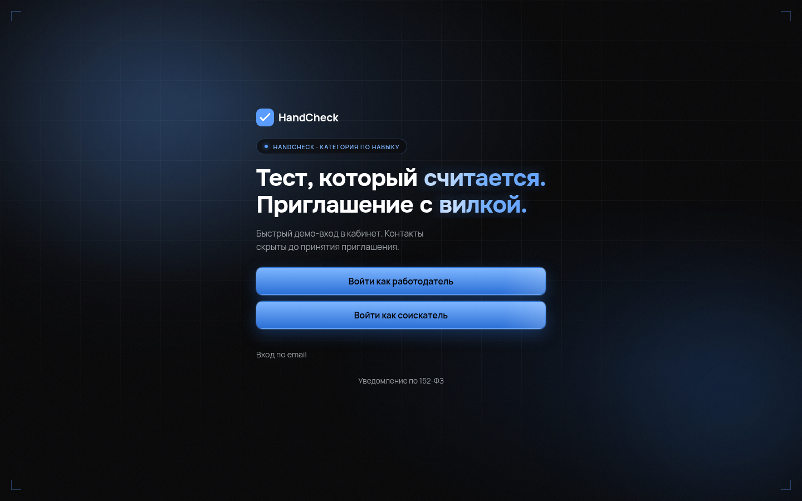
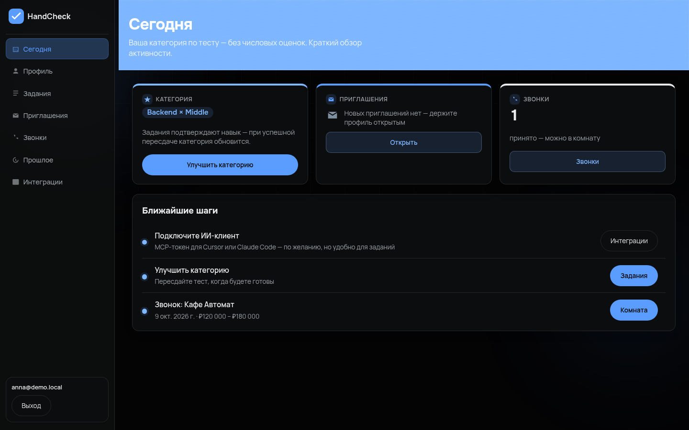
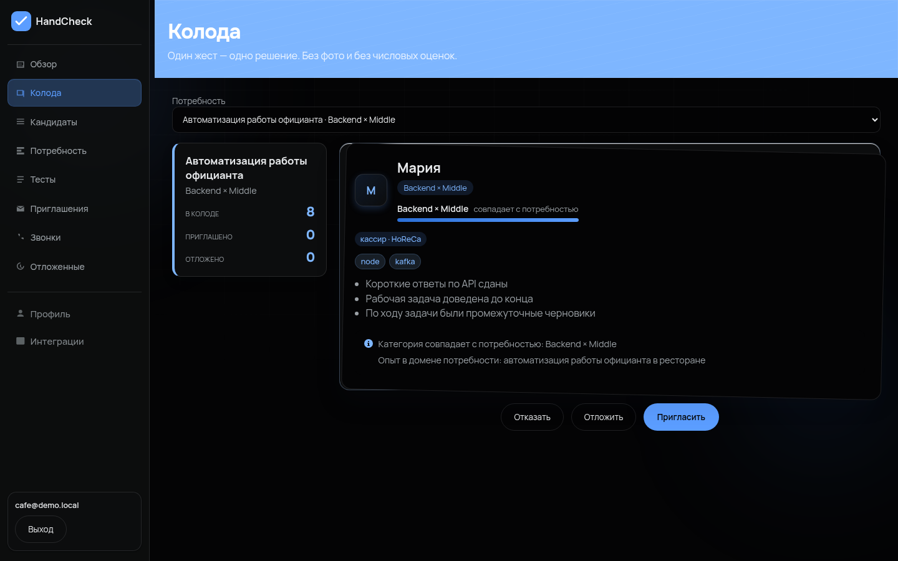

# HandCheck

   

**Skills-first IT hiring для ФСП 2026.** Категорию кандидата определяет не резюме, а батарея
заданий. Работодатель ищет категорию и сам приглашает с вилкой ЗП. Контакты кандидата
открываются только после того, как он принял приглашение.



- 🌐 Прототип: **https://handcheck.baski.pro** — демо-вход в одно нажатие
- 📊 Презентация для жюри: [PDF](docs/presentation/HandCheck-ФСП-2026.pdf) · [PPTX](docs/presentation/HandCheck-ФСП-2026.pptx)
- 📚 Документация: [docs/DOCUMENTATION.md](docs/DOCUMENTATION.md) · [сводный PDF](docs/Documentation-HandCheck.pdf)
- 🔍 Просмотр исходников онлайн: https://handcheck.baski.pro/downloads/source/

## Что это за продукт

Платформа **не** витрина вакансий и **не** «кандидат откликается вслепую».

1. Кандидат проходит опрос → выбирает специализацию и предполагаемый грейд.
2. Проходит батарею: короткие вопросы с серверным дедлайном + мини-проект, оценка по рубрике.
3. Получает категорию `специализация × грейд` — если набрал выше cutoff. Ниже cutoff статус
   «не подтверждён», грейд принудительно **не понижается**.
4. Работодатель описывает потребность → получает подборку по категории с объяснением.
5. Работодатель сам шлёт приглашение с вилкой ЗП — вакансия не нужна.
6. Кандидат принимает или отклоняет; **только после accept** работодатель видит телефон и email.

| Кандидат | Работодатель |
|---|---|
|  |  |

## Почему тест устойчив

Полное описание — [docs/TESTING.md](docs/TESTING.md).

| Проблема из ТЗ | Решение | Проверка |
|---|---|---|
| Один набор заданий у всех — утечка | **162 задания в 9 батареях** (backend / frontend / QA × junior / middle / senior), по две равноценные формы A и B в каждой ячейке | формы A/B на одинаковых ответах: 0.812 / 0.812, **Δ = 0.00** при пороге 0.15 |
| Уникальная LLM-генерация под каждого — несравнимо | LLM даёт только **черновики** заданий работодателю, оценка всегда по банку | cutoff junior 0.55 / middle 0.68 / senior 0.78; сильные ответы 0.734 проходят, слабые 0.000 — нет |
| «Сдать и уйти», выучив ответы | Серверные дедлайны, кулдаун пересдачи `GRADE_COOLDOWN_DAYS` (30 дней), телеметрия попыток | обе формы выдались в **9 из 9** ячеек за 6 выдач |

## Подбор и приватность

- Ранжирование: `0.60 × test_score + 0.15 × мотивация + 0.10 × ФСП + 0.15 × домен`,
  затем совпадение грейда. Подборка всегда по категории из теста.
- Фильтры по стеку и ФСП только сужают выдачу и не ломают уже полученную подборку.
- До accept в API работодателя нет `phone` и `contact_email`, `GET /employer/candidates/:id/contacts` → 403.
- Балл теста и метрики честности не отдаются ни кандидату, ни работодателю.

Подробно: [docs/MATCHING.md](docs/MATCHING.md), [docs/VALIDATION.md](docs/VALIDATION.md).

## Быстрый старт

```bash
git clone https://github.com/BaskovKonstantin/handcheck.git
cd handcheck
cp .env.example .env
npm install
npm start            # http://127.0.0.1:8810
```

Или в Docker:

```bash
docker compose up -d --build
curl -fsS http://127.0.0.1:8810/api/health
```

Демо-аккаунты при `DEMO_MODE=1` (пароль и код подтверждения — в `.env.example`):

| Email | Роль | Состояние |
|---|---|---|
| `anna@demo.local` | кандидат | подтверждённая категория Backend × Middle |
| `boris@demo.local` | кандидат | та же категория, часто «отложен» в колоде |
| `demo-unconf@demo.local` | кандидат | тест не проходил — видно, как категория не выдаётся |
| `cafe@demo.local` | работодатель | потребность «Автоматизация работы официанта» |

Инструкция по развёртыванию и список библиотек с версиями — [docs/DEPLOYMENT.md](docs/DEPLOYMENT.md).

## Что внутри

```text
app/
├── modules/        17 доменов: auth, candidates, employers, needs, assessment,
│                   tasks, matching, deck, invitations, employer-tests, calls,
│                   integrations, mcp, stats, catalog, fsp, vacancies
├── lib/            ranking · rubric-score · privacy · salary-range · llm-client
├── db/             схема, миграции, сид, банк заданий (app/db/battery-catalog)
└── public/         серверные страницы + статический JS без SPA-фреймворка
docs/               архитектура, тест, подбор, валидация, API, деплой, ФСП
scripts/            аудит функционала, метрики валидации, скриншоты, сборка дека
```

Стек: Node.js 20+, Express, SQLite (`better-sqlite3`), WebSocket для комнаты звонка,
Docker Compose, деплой по `main` через self-hosted runner. GPU не требуется.

## Проверки

```bash
npm test                                             # 347 проходят; 9 известных падений есть и на чистом HEAD
npm run validate                                     # качество теста, подбора и приватности
BASE_URL=http://127.0.0.1:8899 node scripts/functional-audit.js                # 41 проверка end-to-end
BASE_URL=https://handcheck.baski.pro AUDIT_MODE=readonly node scripts/functional-audit.js   # 8 проверок на проде
METRICS_JSON=context/metrics-assessment.json node scripts/assessment-metrics.js # числа для отчёта
```

Отчёты и метрики: [context/audits](context/audits), [context/metrics-assessment.json](context/metrics-assessment.json).

## Покрытие ТЗ

Что сделано, чем подтверждено и что честно не сделано — [docs/FUNCTIONAL-COVERAGE.md](docs/FUNCTIONAL-COVERAGE.md).
Коротко: закрыты механика подбора, тест и категоризация, приватность, оба кабинета, короткие
тесты работодателя, звонки с записью, MCP для ИИ-клиентов; не сделаны вакансии с откликом,
разбор PDF-резюме и сетевой адаптер реестра ФСП (схема описана в
[docs/FSP-INTEGRATION.md](docs/FSP-INTEGRATION.md)).

## Документация

| Документ | О чём |
|---|---|
| [docs/DOCUMENTATION.md](docs/DOCUMENTATION.md) | индекс всей документации |
| [docs/TZ.md](docs/TZ.md) | сжатое ТЗ ФСП |
| [docs/ARCHITECTURE.md](docs/ARCHITECTURE.md) | функциональная и компонентная архитектура |
| [docs/TESTING.md](docs/TESTING.md) | механика тестирования и устойчивость подхода |
| [docs/MATCHING.md](docs/MATCHING.md) | механика подбора и логика категоризации |
| [docs/VALIDATION.md](docs/VALIDATION.md) | процедура валидации и результаты |
| [docs/FSP-INTEGRATION.md](docs/FSP-INTEGRATION.md) | схема интеграции с реестром ФСП |
| [docs/API.md](docs/API.md) + [openapi.yaml](openapi.yaml) | описание API |
| [docs/DEPLOYMENT.md](docs/DEPLOYMENT.md) | сборка, развёртывание, запуск, библиотеки |
| [docs/JURY-DEMO.md](docs/JURY-DEMO.md) | клик-маршрут демонстрации жюри |
| [docs/MCP.md](docs/MCP.md) | MCP-интеграция для ИИ-клиентов |
| [AGENTS.md](AGENTS.md) | правила работы агента над проектом |

## Безопасность

Секреты не попадают в репозиторий: `.env` в `.gitignore`, наружу отдаётся только `.env.example`.
API-токены действуют только на `/mcp` и не работают на REST; вызовы ИИ-клиентов пишутся в аудит.
Согласие на обработку данных обязательно при регистрации и при старте батареи, уведомление
152-ФЗ доступно публично (`/privacy`, `GET /api/privacy-notice`).

## Лицензия и контакты

Код проекта HandCheck, разработан в рамках задачи ФСП 2026. Команда и контакты — указать перед
публикацией репозитория (слайды 2–4 презентации содержат те же поля).

---

**Skills-first IT hiring:** категорию даёт тест, приглашение даёт работодатель, контакты — только согласие.